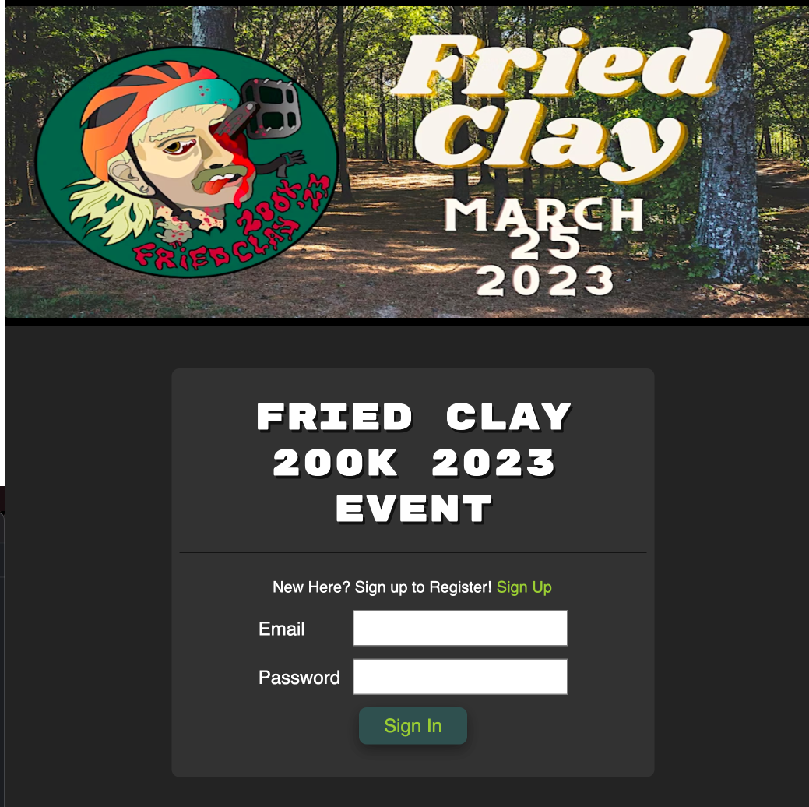
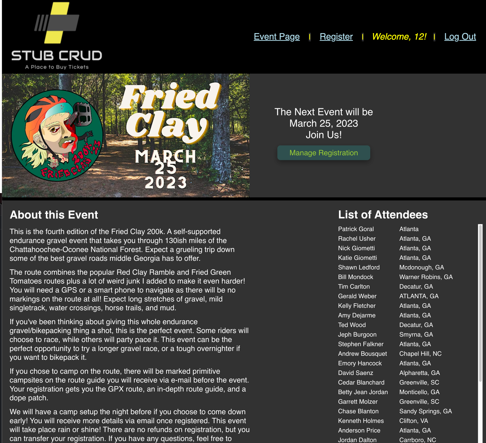
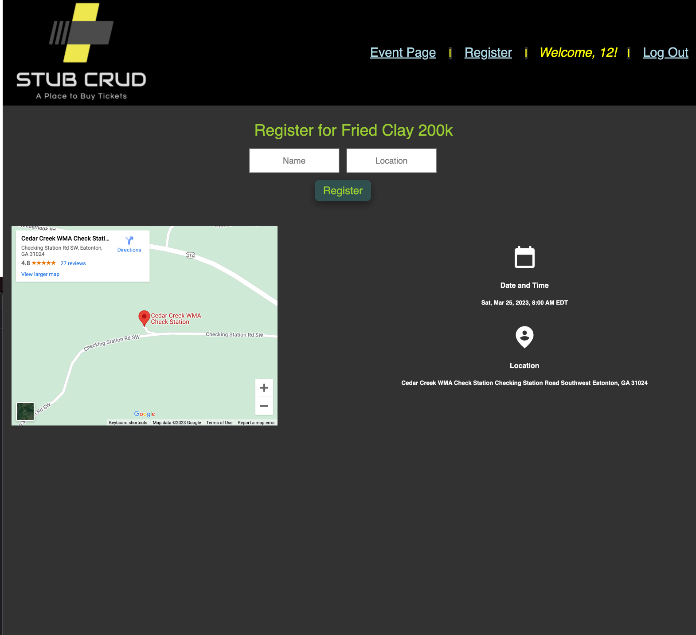
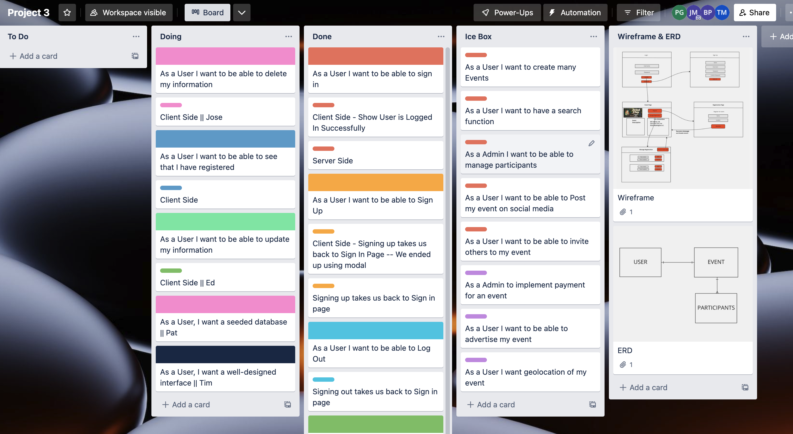
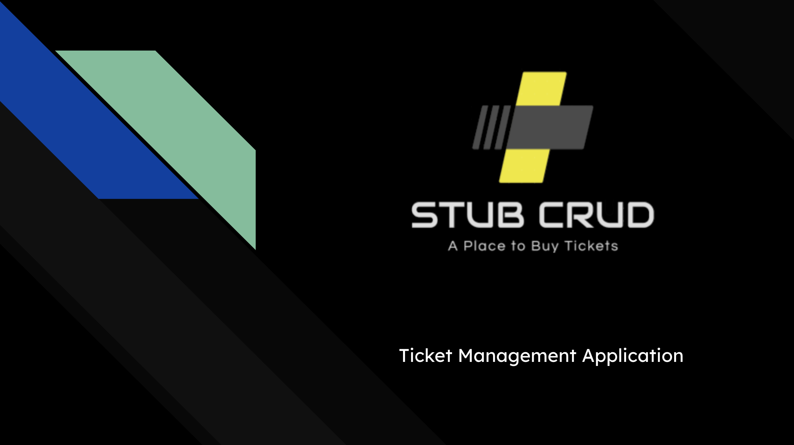

# Stub Crud
## A group project using the MERN-Stack

StubCrud is a web app designed for users to register for events, as well as manage their registrations.  

 

---
## The Team:

| **Name:**            | **Role:**             |
| -------------------- | --------------------- |
|                      |                       |
| **- Jose Melendez:** | - Github Manager      |
|                      | - Front End Developer |
|                      |                       |
| **- Tim Martinson:** | - SCRUM Master        |
|                      | - Front End Developer |
|                      |                       |
| **- Edward Ho:**     | - Front End Developer |
|                      | - UI Design           |
|                      |                       |
| **- Pat Goral:**     | - Back End Developer  |
|                      | * Documenter          |

## Technologies Used

| Code       |          |
| ---------- | -------- |
| React      | Node     |
| JavaScript | Express  |
| HTML5      | MongoDB  |
| Mongoose   | CSS3     |

## Getting Started:

### View the deployed page here:

[View StubCrud](https://trello.com/b/ZFkGbE5Q/project-3)

<table>
<tr>
<td>
  Upon loading the page, you are prompted to sign in or sign up for the service.  Once registered and signed in, you will view the details for the event.  This includes a description as well as a list of all participants registered.  You can register as many participants as you'd like using the register button.  Once registered, you can manage your registrations by either updating or deleting them entirely.  Once finished, you can log out to exit the app.
</td>
</tr>
</table>

## Planning Docs:

### Trello Board:

[View Trello Board](https://trello.com/b/ZFkGbE5Q/project-3)

### Pitch Deck

[View Pitch Deck](https://docs.google.com/presentation/d/1m-4NvatLkOq-8CiPD1W6_KrEP4eqX6Ccz9J3V0H-94g/edit#slide=id.p)

---

## Future Goals:

#### Version 2:

-As a user I want to be able to create many events

-As a user I want to be able to invite others to my event

-As a user I want to have a search function for events

#### Version 3:

-As an admin I want to be able to implement payment for my events

-As an admin I want to be able to manage participants

-As a user I want to be able to post my event on social media.

